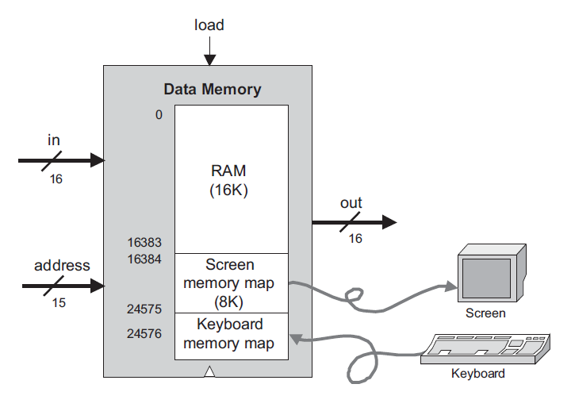
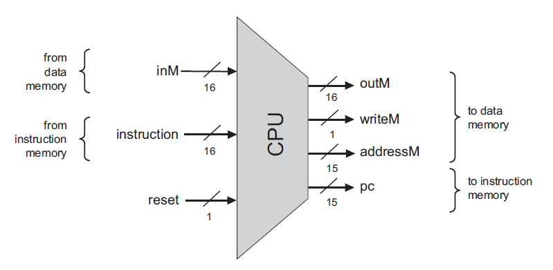
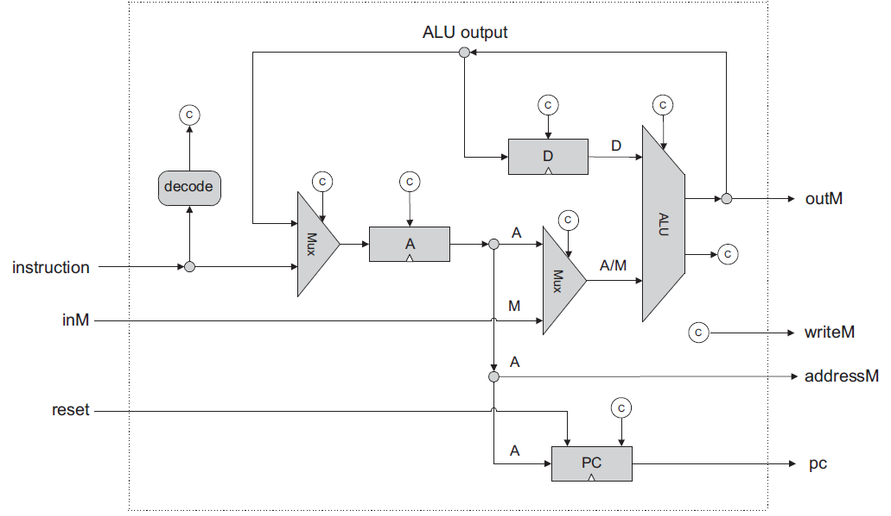

# Project 05

Project 05 implementation as described [here](//nand2tetris.org/05.php).

- Memory

```c++
IN in[16], load, address[15];
OUT out[16];
```



- Central Processing Unit

```c++
IN  inM[16],         // M value input  (M = contents of RAM[A])
    instruction[16], // Instruction for execution
    reset;           // Signals whether to re-start the current
                     // program (reset==1) or continue executing
                     // the current program (reset==0).

OUT outM[16],        // M value output
    writeM,          // Write to M? 
    addressM[15],    // Address in data memory (of M)
    pc[15];          // address of next instruction
```



- Computer

```c++
IN reset;
```


